# SmartBrew POS

> ระบบขายหน้าร้าน (POS) สำหรับร้านกาแฟ/คาเฟ่ + ตัดสต็อกตามสูตร (BOM) + แดชบอร์ด + AI พยากรณ์ยอดขาย
> ทำงานแบบ Local-first · React + TypeScript / FastAPI + Python · ข้อมูลทั้งหมดอยู่ในเครื่อง

---

## 📚 สารบัญ

- [ระบบนี้ทำอะไรได้บ้าง](#-ระบบนี้ทำอะไรได้บ้าง)
- [ผังเมนู & สิทธิ์ผู้ใช้](#-ผังเมนู--สิทธิ์ผู้ใช้)
- [คู่มือการใช้งาน (ฉบับละเอียด)](#-คู่มือการใช้งาน-ฉบับละเอียด)
  - [1. เข้าสู่ระบบ](#1-เข้าสู่ระบบ-login)
  - [2. เปิดกะ / ปิดกะ](#2-เปิดกะ--ปิดกะ-shift)
  - [3. หน้าขาย POS](#3-หน้าขาย-pos)
  - [4. จอครัว / บาร์ (KDS)](#4-จอครัว--บาร์-kds)
  - [5. แดชบอร์ด (Dashboard)](#5-แดชบอร์ด-dashboard)
  - [6. AI Insights](#6-ai-insights)
  - [7. จัดการหลังร้าน (Admin)](#7-จัดการหลังร้าน-admin)
    - [7.1 สินค้า / เมนู + อัปโหลดรูป](#71-สินค้า--เมนู--อัปโหลดรูปจากเครื่อง)
    - [7.2 บิล / ออเดอร์](#72-บิล--ออเดอร์)
    - [7.3 วัตถุดิบ · สูตร · คลังสต็อก](#73-วัตถุดิบ--สูตร-bom--คลังสต็อก)
    - [7.4 ตัวเลือก · ส่วนลด · เงินสด · คืนเงิน · ตั้งค่า](#74-กลุ่มตัวเลือก--ส่วนลด--ลิ้นชักเงินสด--คืนเงิน--ตั้งค่า)
  - [8. เคล็ดลับ & คำถามที่พบบ่อย](#8-เคล็ดลับ--คำถามที่พบบ่อย)
- [การติดตั้ง (สำหรับนักพัฒนา)](#-การติดตั้ง-สำหรับนักพัฒนา)
- [คำสั่งที่ใช้บ่อย](#-คำสั่งที่ใช้บ่อย)
- [Stack & โครงสร้างโปรเจกต์](#-stack--โครงสร้างโปรเจกต์)

---

## ✨ ระบบนี้ทำอะไรได้บ้าง

| โมดูล | ใช้ทำอะไร |
|-------|-----------|
| **POS (หน้าขาย)** | เลือกเมนู → ใส่ตะกร้า → เลือกช่องทาง (ทานที่ร้าน/กลับบ้าน) → ชำระเงิน (เงินสด/QR/บัตร) → พิมพ์ใบเสร็จ |
| **กะการขาย (Shift)** | เปิดกะพร้อมเงินตั้งต้น → ขายทั้งวัน → ปิดกะ นับเงิน เทียบส่วนต่าง |
| **KDS (จอครัว/บาร์)** | ออเดอร์ที่ส่งเข้าครัวเด้งขึ้นจอ แยกสถานี บาร์/ครัว แตะ “เสร็จ” เมื่อทำเสร็จ |
| **Dashboard** | ยอดขาย กำไรขั้นต้น เมนูขายดี ช่วงเวลาขายดี สัดส่วนหมวด |
| **AI Insights** | พยากรณ์ยอดขายรายเมนู 14 วันล่วงหน้า + แนะนำปริมาณสั่งวัตถุดิบ (รันในเครื่องผ่าน Ollama) |
| **จัดการหลังร้าน** | เมนู/ราคา/รูป · วัตถุดิบ · สูตร (BOM) · คลังสต็อก · ส่วนลด · ตัวเลือกเสริม · ลิ้นชักเงินสด · คืนเงิน · บันทึกการใช้งาน · ตั้งค่า |

---

## 🔑 ผังเมนู & สิทธิ์ผู้ใช้

แถบเมนูด้านบนจะเปลี่ยนตาม **บทบาท (role)** ของผู้ใช้:

| เมนู | พนักงาน (staff) | ผู้ดูแล (admin) |
|------|:---:|:---:|
| POS · กะ · KDS | ✅ | ✅ |
| Dashboard · AI · จัดการ (Admin) | ❌ | ✅ |

> **บัญชีเริ่มต้น** (ตั้งใน `backend/.env` → `SEED_ADMIN_*`): ผู้ใช้ `admin` / รหัส `change-me-on-first-run`
> ⚠️ **เปลี่ยนรหัสผ่านนี้ทันทีเมื่อใช้งานจริง**

---

## 📖 คู่มือการใช้งาน (ฉบับละเอียด)

### 1. เข้าสู่ระบบ (Login)

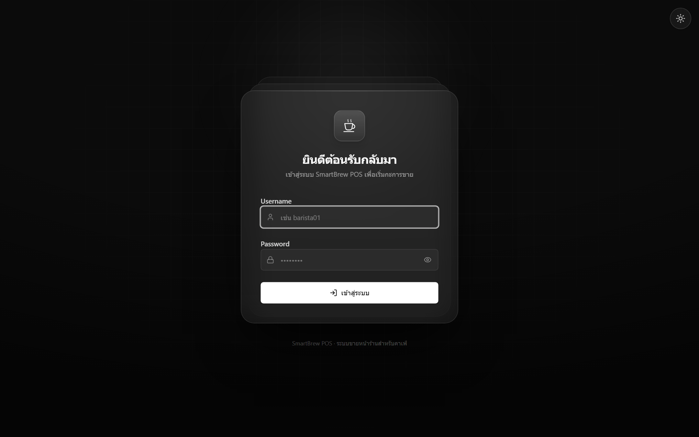

1. เปิดเบราว์เซอร์ไปที่ที่อยู่ของแอป (เช่น `http://localhost:5173`)
2. กรอก **Username** และ **Password** (ค่าเริ่มต้น `admin` / `change-me-on-first-run`)
3. กดปุ่ม 👁 เพื่อดู/ซ่อนรหัสผ่าน และกดปุ่มดวงอาทิตย์/ดวงจันทร์มุมขวาบนเพื่อสลับโหมดสว่าง–มืด
4. กด **เข้าสู่ระบบ** — ระบบจะพาไปหน้า POS อัตโนมัติ

> ระบบใช้ JWT + คุกกี้ httpOnly; access token เก็บในหน่วยความจำเท่านั้น (รีเฟรชหน้าแล้วต้องเข้าสู่ระบบใหม่ ถือว่าปกติเพื่อความปลอดภัย)

---

### 2. เปิดกะ / ปิดกะ (Shift)

หน้า **กะ** ใช้คุมเงินสดในลิ้นชักต่อหนึ่งรอบการขาย

- **เปิดกะ:** กรอก “เงินตั้งต้น” (เงินทอนที่ใส่ลิ้นชักตอนเริ่ม) แล้วกด **เปิดกะ** — หลังจากนี้จึงจะเริ่มขายในหน้า POS ได้
- **ปิดกะ:** เมื่อเลิกงาน นับเงินสดจริงในลิ้นชักแล้วกรอกใน “เงินสดที่นับได้” → กด **ปิดกะ** ระบบจะคำนวณ *เงินที่ควรมี* และ *ส่วนต่าง* ให้

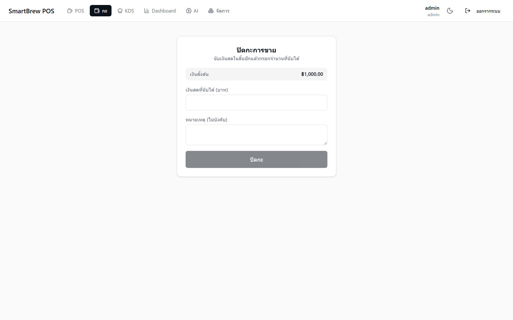

> ถ้าเปิดหน้า POS แล้วถูกบังคับให้เปิดกะก่อน แปลว่ายังไม่มีกะที่เปิดอยู่ — กลับมาเปิดกะที่หน้านี้

---

### 3. หน้าขาย POS

หน้าจอหลักของแคชเชียร์ แบ่งเป็น 3 ส่วน: **แถบหมวด (ซ้าย)** · **ตารางเมนู (กลาง)** · **ตะกร้า (ขวา)**

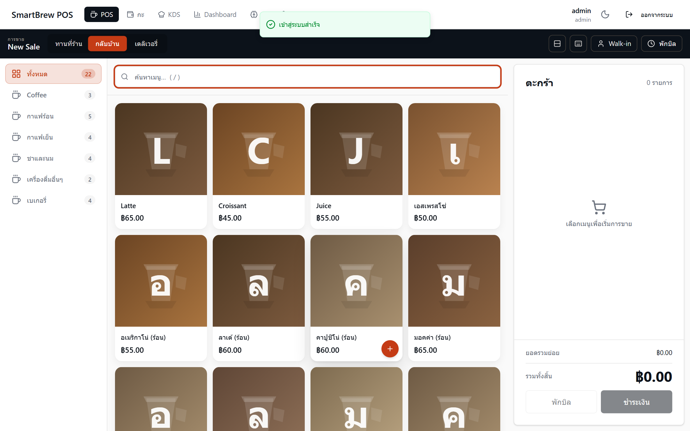

**ขั้นตอนการขาย 1 บิล:**

1. เลือก **ช่องทางการขาย** ด้านบน: *ทานที่ร้าน* หรือ *กลับบ้าน* (และระบุเลขโต๊ะ/ลูกค้าได้)
2. เลือก **หมวด** จากแถบซ้าย (ตัวเลขคือจำนวนเมนูในหมวด) หรือพิมพ์ค้นหา/สแกนบาร์โค้ดในช่องค้นหา
3. **แตะการ์ดเมนู** เพื่อหยิบลงตะกร้า — ถ้าเมนูมีตัวเลือกเสริม (เช่น หวานน้อย/เพิ่มช็อต) จะมีหน้าต่างให้เลือกก่อน
4. ปรับจำนวนในตะกร้า เพิ่ม/ลด หรือลบรายการได้

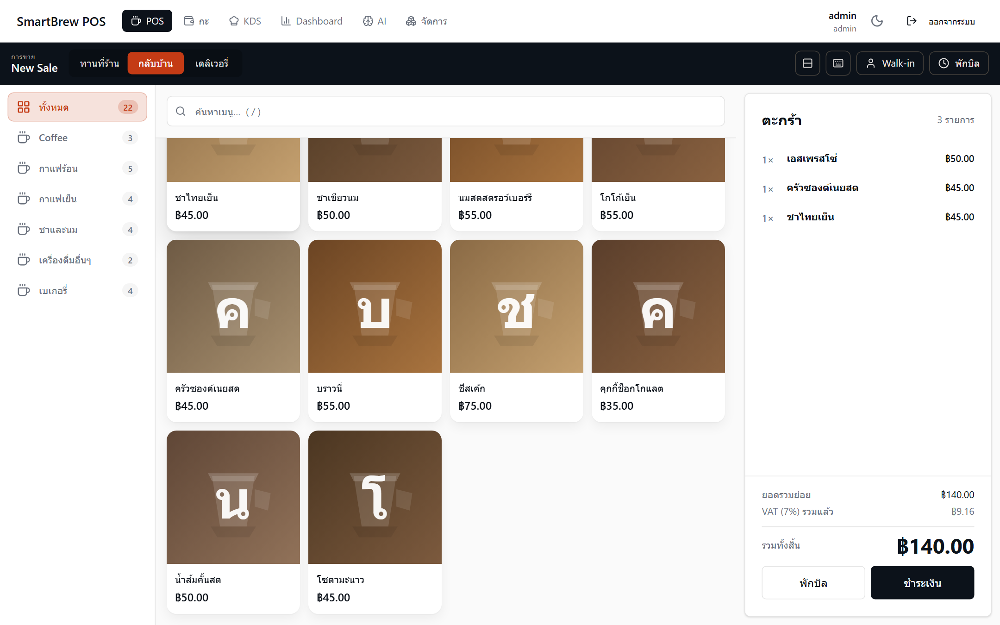

5. ตรวจ **ยอดรวมย่อย / VAT / รวมทั้งสิ้น** ทางขวาล่าง
6. กด **ชำระเงิน** → เลือกวิธีจ่าย (เงินสด/QR พร้อมเพย์/บัตร) ระบบคิดเงินทอนให้ → ยืนยัน → พิมพ์ใบเสร็จ
7. ถ้าลูกค้ายังไม่จ่าย กด **พักบิล** เพื่อเก็บไว้ก่อนแล้วเรียกกลับมาทำต่อภายหลัง

> เมื่อกด “ส่งเข้าครัว” รายการจะไปโผล่ที่จอ KDS และระบบจะ **ตัดสต็อกวัตถุดิบตามสูตร (BOM)** ให้อัตโนมัติ

---

### 4. จอครัว / บาร์ (KDS)

หน้า **KDS** (Kitchen Display System) แสดงออเดอร์ที่ส่งเข้าครัว แยกเป็นคอลัมน์ตามสถานี **บาร์** และ **ครัว**

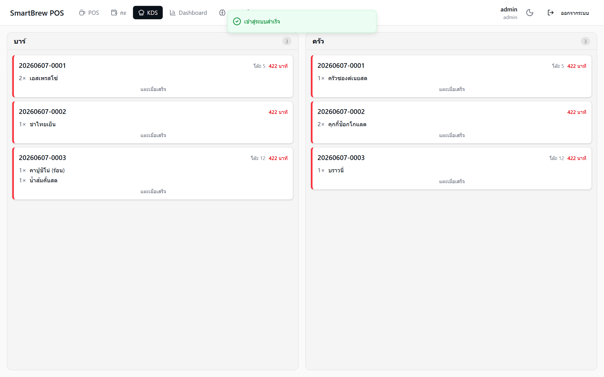

- แต่ละ “ตั๋ว” แสดง เลขที่บิล · เลขโต๊ะ · เวลาที่ผ่านไป · รายการและจำนวน
- เมนูจะถูกส่งเข้าสถานีไหนขึ้นกับ **หมวด** ของสินค้า (ตั้งได้ในหน้าจัดการ)
- เมื่อทำเสร็จ กด **แตะเมื่อเสร็จ** เพื่อเอาตั๋วออกจากจอ
- เหมาะกับการเปิดค้างบนแท็บเล็ต/จอหลังบาร์ (อัปเดตอัตโนมัติ)

---

### 5. แดชบอร์ด (Dashboard)

หน้าสรุปผลประกอบการ (เฉพาะ admin) เลือกช่วงวันที่ได้ที่มุมขวาบน

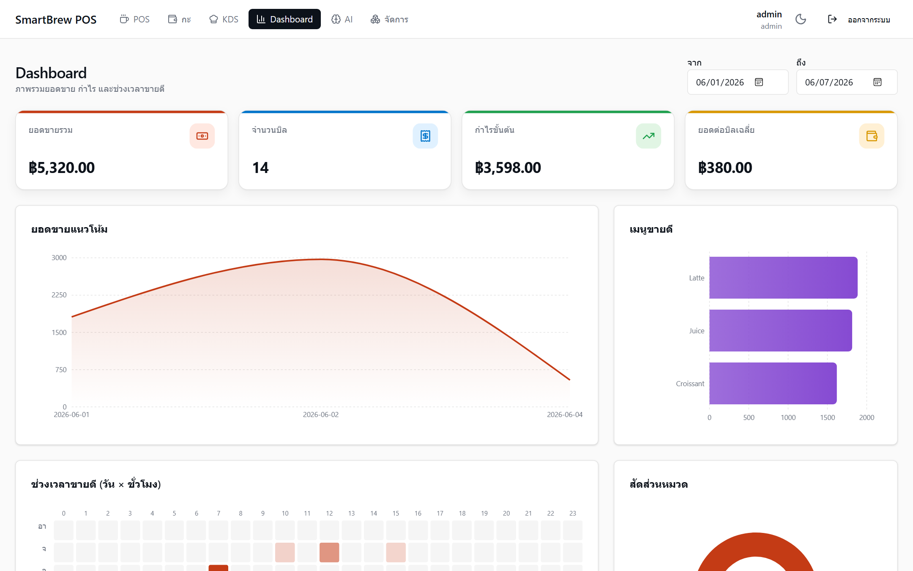

- **การ์ดสรุป (KPI):** ยอดขาย · จำนวนบิล · กำไรขั้นต้น · ยอดที่ต้องจับตา
- **ยอดขายรายวัน:** กราฟเส้นแนวโน้มยอดขาย
- **เมนูขายดี:** กราฟแท่งจัดอันดับเมนู
- **ช่วงเวลาขายดี:** ตารางความร้อน (heatmap) ดูว่าชั่วโมงไหนขายดี
- **สัดส่วนหมวด:** กราฟวงกลมสัดส่วนยอดขายต่อหมวด

---

### 6. AI Insights

โมดูล AI พยากรณ์ยอดขายและแนะนำการสั่งวัตถุดิบ — ประมวลผล **ในเครื่อง** ทั้งหมด

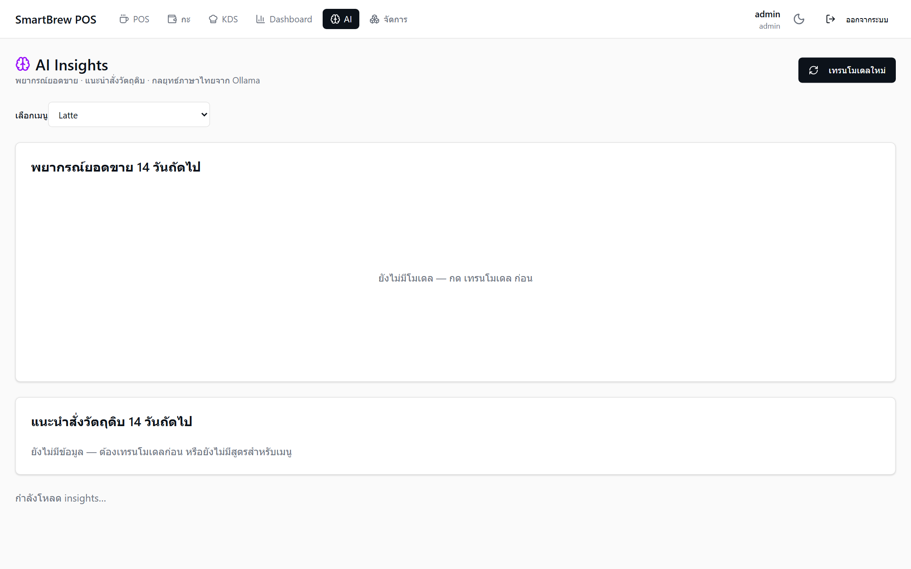

1. เลือก **เมนู** ที่ต้องการวิเคราะห์จาก dropdown
2. กด **เทรนโมเดลใหม่** เพื่อสร้างโมเดลจากประวัติการขาย (ทำครั้งแรก/เมื่อข้อมูลเปลี่ยนมาก)
3. ระบบจะแสดง **พยากรณ์ยอดขาย 14 วันถัดไป** และ **คำแนะนำปริมาณสั่งวัตถุดิบ**

> ส่วนสรุปเชิงกลยุทธ์ภาษาไทยใช้ LLM ผ่าน **Ollama** ที่รันในเครื่อง — ต้องติดตั้ง Ollama และ pull โมเดล (เช่น `llama3.1:8b`) ก่อน หากยังไม่ได้เทรน หน้าจะขึ้นข้อความให้กดเทรนก่อน

---

### 7. จัดการหลังร้าน (Admin)

กดเมนู **จัดการ** บนแถบบน จะเข้าสู่โซนหลังร้าน ที่มีแถบเมนูย่อย:
`บิล · สินค้า · วัตถุดิบ · สูตร (BOM) · คลังสต็อก · ส่วนลด · กลุ่มตัวเลือก · ลิ้นชักเงินสด · คืนเงิน · บันทึกการใช้งาน · ตั้งค่า`

#### 7.1 สินค้า / เมนู + อัปโหลดรูปจากเครื่อง

หน้า **สินค้า** คือที่จัดการเมนูทั้งหมด: ชื่อ หมวด ราคา ต้นทุน รหัสสแกน และสถานะขาย

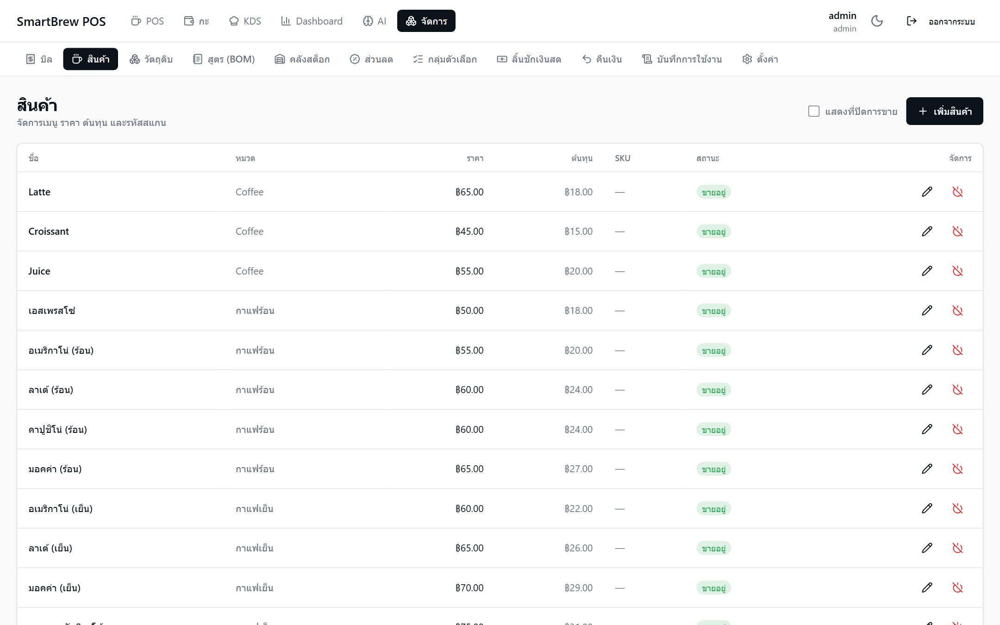

**เพิ่มเมนูใหม่:**

1. กดปุ่ม **➕ เพิ่มสินค้า** มุมขวาบน
2. กรอกข้อมูลในหน้าต่าง:
   - **ชื่อสินค้า** (จำเป็น)
   - **หมวด** — เลือกจากที่มี หรือเว้นเป็น “ไม่มีหมวด”
   - **ราคาขาย (บาท)** และ **ต้นทุน (บาท)**
   - **SKU / บาร์โค้ด** (ไม่บังคับ — ใช้สำหรับสแกนเพิ่มลงตะกร้า)
   - **รูปภาพสินค้า** — กด **“เลือกรูปจากเครื่อง”** เพื่อเลือกไฟล์รูปจากคอมพิวเตอร์ (รองรับ PNG/JPG/WebP/GIF) ระบบจะอัปโหลดและแสดงตัวอย่างทันที หรือจะวาง **URL รูปภาพ** เองก็ได้
3. กด **เพิ่ม** — เมนูใหม่จะไปแสดงในหน้า POS พร้อมรูปทันที

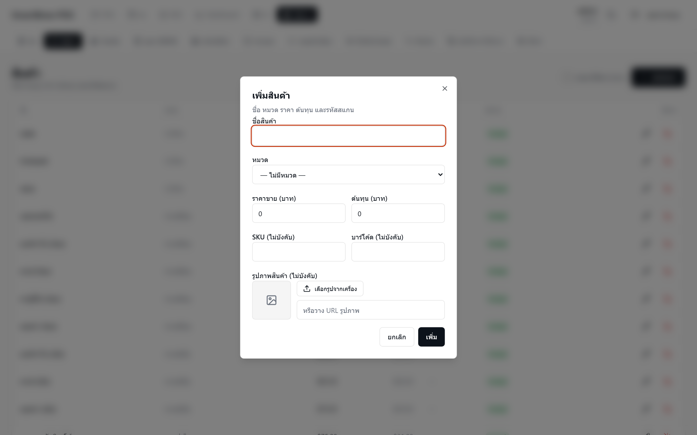

**แก้ไข / ปิดการขาย:**

- ไอคอน ✏️ = แก้ไขเมนู (เปลี่ยนชื่อ/ราคา/รูป ฯลฯ)
- ไอคอน 🔌 = เปิด/ปิดการขายเมนู (ปิดแล้วเมนูจะหายจาก POS แต่บิลเก่ายังอ้างอิงได้ — ไม่ลบจริงเพื่อรักษาประวัติ)
- ติ๊ก **“แสดงที่ปิดการขาย”** เพื่อดูเมนูที่ถูกปิดไว้

#### 7.2 บิล / ออเดอร์

ดูบิลทั้งหมด: เลขที่บิล · ช่องทาง · สถานะ (ชำระแล้ว/พักไว้/ยกเลิก) · ยอดสุทธิ · เวลา — กรองตามสถานะได้ และเปิดดูรายละเอียด/จัดการวงจรบิลได้

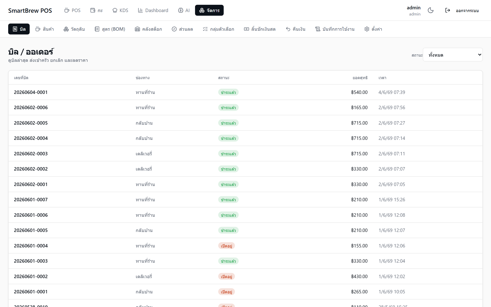

#### 7.3 วัตถุดิบ · สูตร (BOM) · คลังสต็อก

ส่วนนี้ทำให้ระบบ “ตัดสต็อกอัตโนมัติเมื่อขาย” ได้:

| หน้า | หน้าที่ | ภาพ |
|------|---------|-----|
| **วัตถุดิบ** | สร้างวัตถุดิบ + หน่วย (กรัม/มล./ชิ้น) เช่น เมล็ดกาแฟ นมสด | 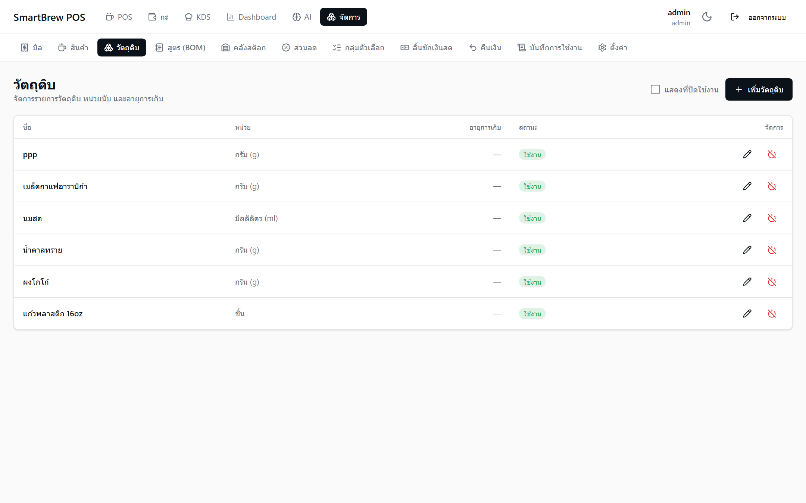 |
| **สูตร (BOM)** | กำหนดว่าเมนู 1 แก้วใช้วัตถุดิบอะไรกี่หน่วย — ระบบจะตัดสต็อกตามนี้ | 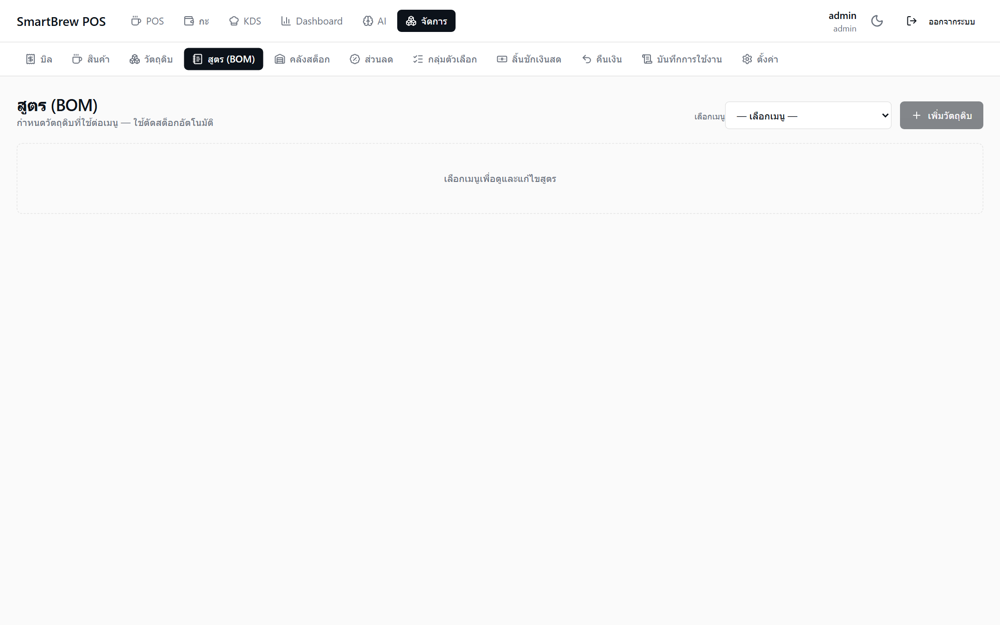 |
| **คลังสต็อก** | ดูคงเหลือ · รับเข้าสต็อก · ตั้งจุดสั่งซื้อซ้ำ (reorder point) | 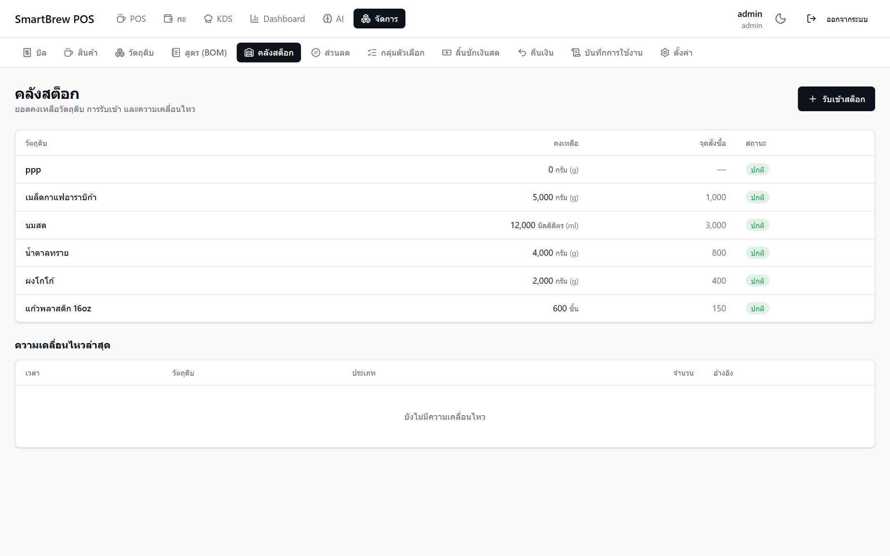 |

**ลำดับแนะนำ:** สร้างวัตถุดิบ → รับสต็อกเข้า → ผูกสูตรให้เมนู → ขายแล้วสต็อกจะลดอัตโนมัติเมื่อส่งเข้าครัว

#### 7.4 กลุ่มตัวเลือก · ส่วนลด · ลิ้นชักเงินสด · คืนเงิน · ตั้งค่า

| หน้า | หน้าที่ | ภาพ |
|------|---------|-----|
| **กลุ่มตัวเลือก** | สร้างตัวเลือกเสริมของเมนู เช่น “ระดับความหวาน”, “เพิ่มช็อต”, “ชนิดนม” กำหนดเลือกได้กี่อย่าง/บังคับเลือกหรือไม่ | 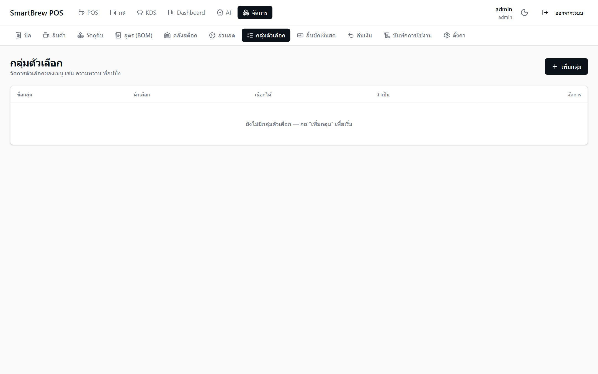 |
| **ส่วนลด** | สร้างโค้ด/รายการส่วนลด (บาทหรือ %) กำหนดว่าต้องสิทธิ์แอดมินหรือไม่ | 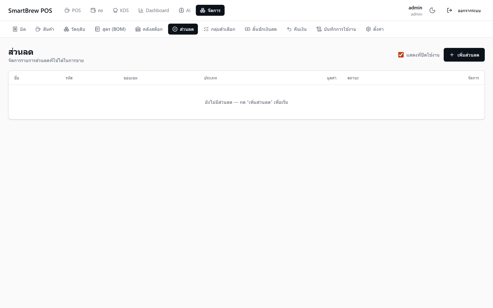 |
| **ลิ้นชักเงินสด** | บันทึกเงินเข้า–ออกนอกการขาย (เติมเงินทอน/เบิกจ่าย) | 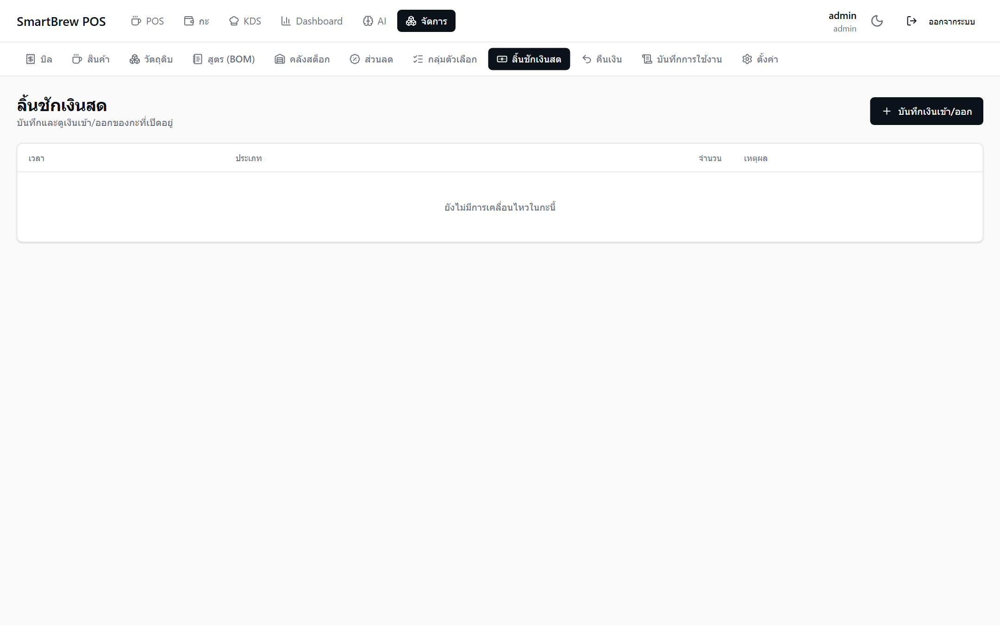 |
| **ตั้งค่า** | ตั้งค่าร้าน · ภาษี (VAT) · Service charge · การปัดเศษ · แต้มสะสม ฯลฯ | 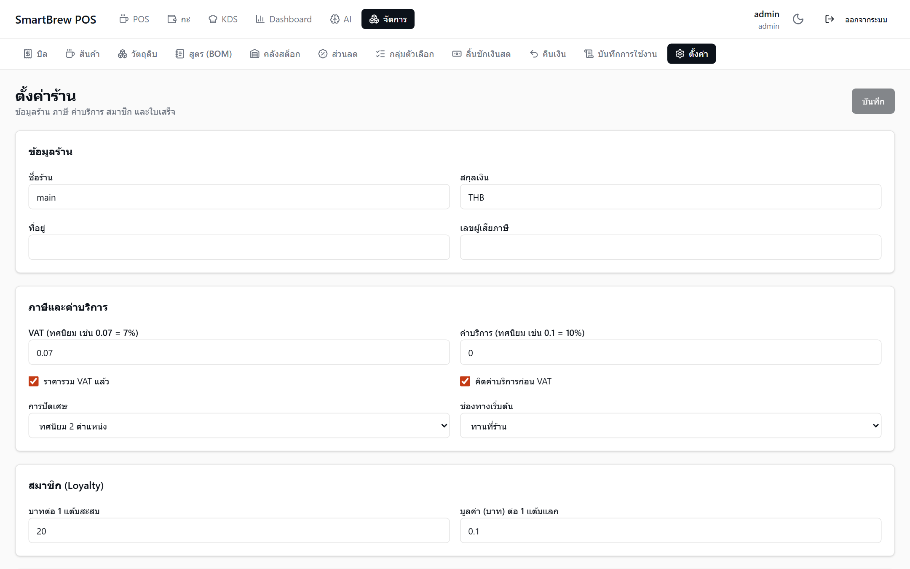 |

นอกจากนี้ยังมี **คืนเงิน** (สร้างรายการคืนเงินอ้างอิงบิลเดิม) และ **บันทึกการใช้งาน** (audit log ของการกระทำสำคัญ)

---

### 8. เคล็ดลับ & คำถามที่พบบ่อย

- **สลับโหมดสว่าง/มืด:** ปุ่มดวงอาทิตย์/ดวงจันทร์มุมขวาบนทุกหน้า
- **เข้า POS ไม่ได้ บังคับให้เปิดกะ?** ไปหน้า **กะ** แล้วกดเปิดกะก่อน
- **รูปเมนูไม่ขึ้น?** รูปที่อัปโหลดถูกเก็บที่ฝั่งเซิร์ฟเวอร์และเสิร์ฟผ่านพาธ `/media/...` — ใน dev เปิดผ่าน `http://localhost:5173` (Vite จะ proxy ให้) รูปจะแสดงปกติ
- **AI ไม่แสดงผล?** ต้องกด **เทรนโมเดลใหม่** ก่อน และต้องมีประวัติการขายพอสมควร; ส่วนสรุปภาษาไทยต้องเปิด Ollama
- **ลืมรหัสแอดมิน?** แก้ `SEED_ADMIN_PASSWORD` ใน `backend/.env` (ใช้กับการสร้างผู้ใช้ครั้งแรกเท่านั้น)

> 📷 รูปประกอบทั้งหมดอยู่ในโฟลเดอร์ [`docs/images/`](docs/images) — สร้างใหม่ได้โดยรันแอปแล้วถ่ายหน้าจอซ้ำ

---

## 🛠 การติดตั้ง (สำหรับนักพัฒนา)

> ติดตั้งก่อน: [Python 3.11+](https://www.python.org/) · [Node 20+](https://nodejs.org/) · [`uv`](https://docs.astral.sh/uv/) · [`pnpm`](https://pnpm.io/) · (ตัวเลือก) [Ollama](https://ollama.com/) สำหรับโมดูล AI

### Backend

```powershell
cd backend
uv sync                                  # ติดตั้ง dependencies
copy .env.example .env                   # แล้วแก้ค่า secret ใน .env
uv run alembic upgrade head              # apply migrations
uv run uvicorn app.main:app --reload     # http://localhost:8000
```

API docs (Swagger): <http://localhost:8000/docs>

### Frontend

```powershell
cd frontend
pnpm install
pnpm dev                                 # http://localhost:5173
```

เปิดเบราว์เซอร์ที่ <http://localhost:5173> แล้วเข้าสู่ระบบด้วยบัญชีแอดมินเริ่มต้น

---

## ⌨️ คำสั่งที่ใช้บ่อย

| งาน | คำสั่ง |
|-----|--------|
| รัน backend dev server | `cd backend && uv run uvicorn app.main:app --reload` |
| รัน frontend dev server | `cd frontend && pnpm dev` |
| สร้าง migration ใหม่ | `cd backend && uv run alembic revision --autogenerate -m "msg"` |
| Apply migration | `cd backend && uv run alembic upgrade head` |
| Lint+format backend | `cd backend && uv run ruff check . && uv run ruff format .` |
| Type-check backend | `cd backend && uv run mypy app` |
| Test backend | `cd backend && uv run pytest -q` |
| Lint / Type-check / Test frontend | `cd frontend && pnpm lint && pnpm typecheck && pnpm test` |

---

## 🧱 Stack & โครงสร้างโปรเจกต์

| ชั้น | ใช้ |
|------|-----|
| Frontend | React 18+ · TypeScript (strict) · Vite + SWC · Tailwind · shadcn/ui · TanStack Query · Zustand · React Hook Form + Zod · Recharts |
| Backend | Python 3.11+ · FastAPI · SQLModel · Alembic · Pydantic v2 |
| DB | SQLite (ผ่าน SQLModel + Alembic) |
| Auth | OAuth2 password flow · JWT access + refresh (httpOnly cookie) · Argon2id |
| AI | LightGBM · scikit-learn · mlxtend · Ollama (local LLM) |
| Pkg mgr | `uv` (backend) · `pnpm` (frontend) |

```
.
├── backend/   # FastAPI · SQLModel · Alembic · ai/ (LightGBM, Ollama)
├── frontend/  # React + TS (Vite-SWC) · Tailwind · shadcn/ui · TanStack Query
├── docs/
│   ├── architecture-spec.md   # spec ตัวเต็ม (Thai)
│   ├── pos-guide.md           # คู่มือ onboarding เพิ่มเติม
│   └── images/                # ภาพหน้าจอประกอบ README
├── CLAUDE.md                  # กฎทำงานของ Claude Code
└── README.md                  # ไฟล์นี้
```

รายละเอียดสถาปัตยกรรม + workflow 8 ขั้น อยู่ใน [`docs/architecture-spec.md`](docs/architecture-spec.md) · สรุปกฎที่ใช้บ่อยใน [`CLAUDE.md`](CLAUDE.md)

---

## License

Private — สำหรับใช้งานภายในร้านเท่านั้น
